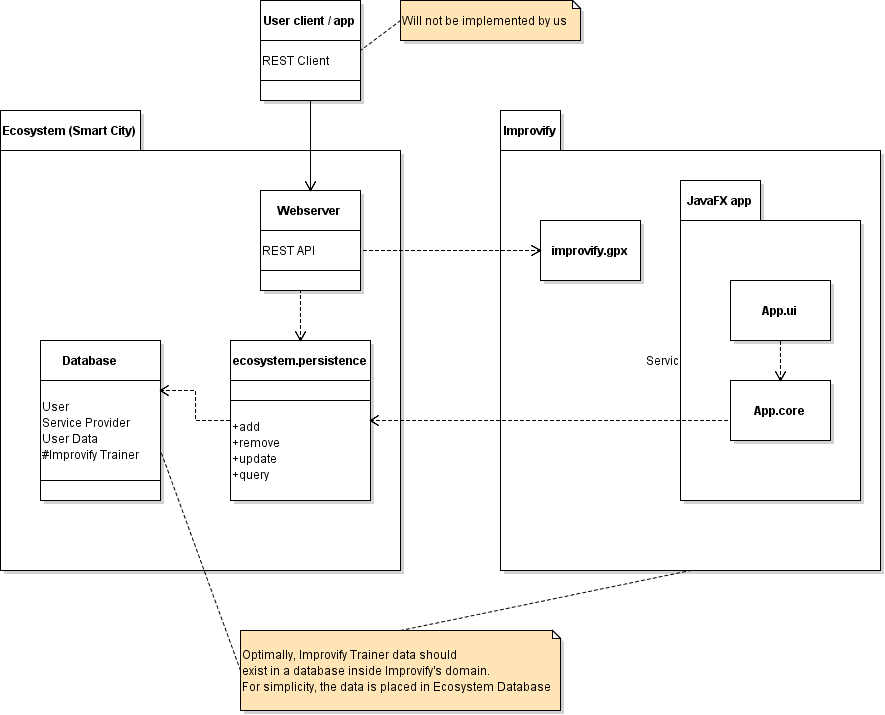

# Gruppe 17

## Project Improvify

Goal oriented training application

* [x] Oppgave for 5. februar: Update templates fra Trætteberg  
* [x] Oppgave for 15. februar: Releaseplan  
* [x] Oppgave for 8.mars: Sprint 1  
* [x] Oppgave for 15.mars: Demo 1  
* [x] Oppgave for 22.mars: Sprint 2  
* [ ] Oppgave for 16.april: Sprint 3  

> Hei studass, ingen på gruppa vår bruker Eclipse.  
> Kjipern hvis du ikke får satt opp plugins for Eclipse.  
> Alle plugins vi bruker skal eksistere for Eclipse også.  
> `Maven verify` skal kjøre uansett.

## Running

1. Set up a MySql server
2. Run the [schema in docs](/docs/Database-design/mainDB create ecosystem.sql) in the database

### Web server

1. Open [App](/tdt4140-gr1817/serviceprovider.webserver/src/main/java/tdt4140/gr1817/serviceprovider/webserver/App.java) in `serviceprovider.webserver`
2. Make sure database connection info is correct. By default it connects to `root@localhost:3306`
3. Start `main` in `App`

### Improvify JavaFX GUI

1. Open [Main](/tdt4140-gr1817/app.ui/src/main/java/tdt4140/gr1817/app/ui/Main.java) in `app.ui`
2. Make sure database connection info is correct. By default it connects to `root@localhost:3306`
3. Start `main` in `Main`

## Wiki

For more management-centered stuff, and less developer/code-centered,
check out our gitlab wiki.

## Architecture

## Plugins

* Checkstyle
    * **IntelliJ:** Checkstyle-IDEA
    * **Eclipse:** [eclipse-cs](https://checkstyle.github.io/eclipse-cs/#!/)
* Error-prone
    * **IntelliJ:** Error-prone Compiler Integration
    * **Eclipse:** Should just work. If not, use Findbugs instead
* [Lombok](/docs/Lombok.png)
    * **IntelliJ:** Lombok plugin
    * **Eclipse:** [Get installer from projectlombok.org](https://projectlombok.org/setup/eclipse)

### Error-prone setup

#### IntelliJ 

1. File > Settings
2. Search for compiler
3. Java Compiler
4. Enable `javac with error-prone` ([se bilde](/docs/error-prone.png))

### Checkstyle setup

#### IntelliJ

1. File > Settings
2. Other Settings > Checkstyle
3. Green "+", Description: "`Local xml`", File: "`checkstyle.xml`", select *"Store relative to project location"*
4. Check *"Active"* for *"Local xml"*
5. OK

## Help

### Explanation of dependencies

 Name | Description 
------|-------------
Jackson | JSON de/serializer
Guice | Dependency injection
JUnit | Unit test framework
TestFX | JUnit extension for JavaFX UI tests
Hamcrest | Matchers for use in test assertions
Mockito | Mocking for use in tests
SLF4J | Logging facade (Combined with Logback for actual implementation of logging)
[Lombok](/docs/Lombok.png) | Generate **get**ers, **set**ers, static SLF4J **log** field, Builder pattern

#### Build dependencies / plugins

Name | Description
-----|------------
Jacoco | Test coverage
Maven Shade | Combine all dependencies to a single executable JAR
Error-prone | Look for possible mistakes in the code
Checkstyle | Enforce code style (Ours is in [checkstyle.xml](/tdt4140-gr1817/checkstyle.xml))
Build helper | Configures `src/it/java` as integration test source

### General issues 
> Maven pom.xml can't find specified version of a dependency

**IntelliJ**: File > Settings > Build, Execution, Deployment > Build Tools > Maven: Select *"Use plugin registry"*
